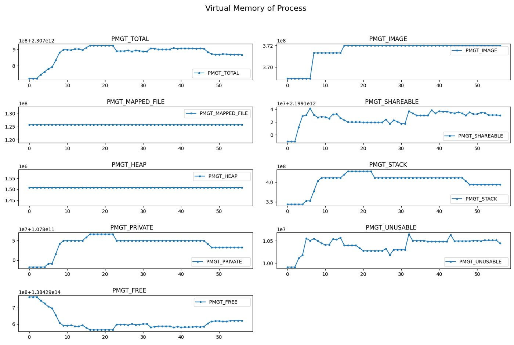
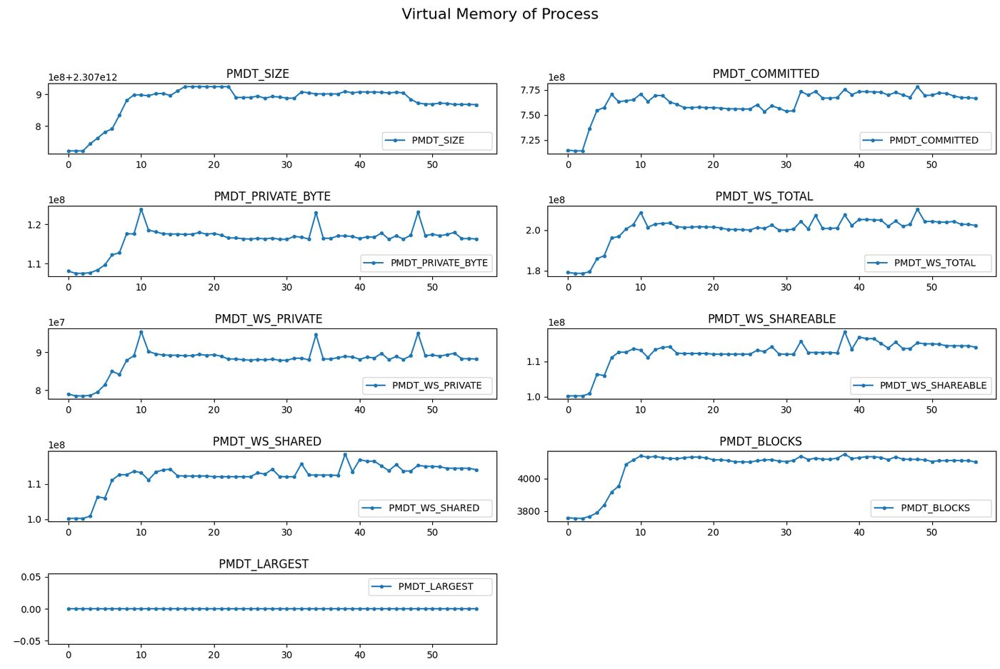
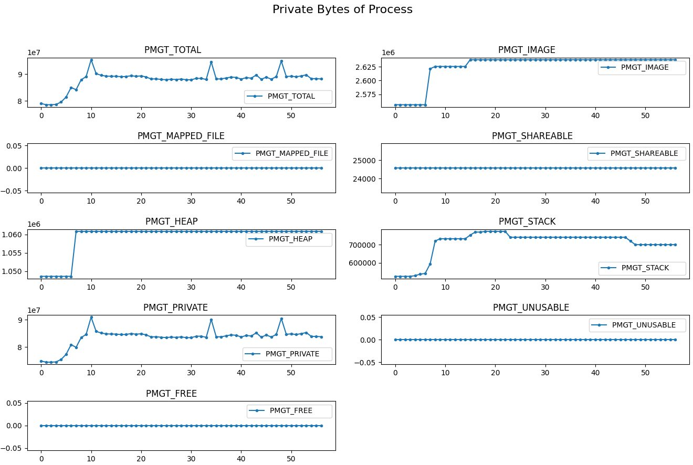
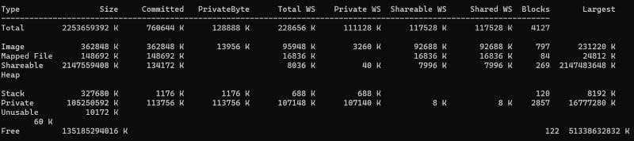

# MemoryTracer

## The goal

MemoryTracer answers one question: where is a Windows process's virtual memory
actually going? It is a small C++ static library that takes snapshots of a live
process — committed, reserved, private, working set, broken down by heap, stack,
image and mapped file — on a schedule you control, and exports them to CSV so you
can watch memory move over time instead of guessing from a single number in Task
Manager. You can link it into your own process and snapshot exactly when it
matters, or point it at another process by PID and leave that one untouched.

I wrote up what I learned building it, in two parts on LinkedIn:

- [A very shallow overview of Windows memory management](https://www.linkedin.com/pulse/very-shallow-overview-windows-memory-management-mellah-thzse) — virtual vs. physical, and how to measure either one honestly
- [Delving deep into Windows memory management](https://www.linkedin.com/pulse/delving-deep-windows-memory-management-brahim-redouane-mellah--uzaee) — private data, stack, heap, mapped files and images, with `VirtualAlloc`, file-mapping and `std::vector` worked through

Both are also on [ibraverse.ca/tech](https://ibraverse.ca/tech/).

## What it shows



*Virtual memory by type, across a process's life. Each band is a kind of memory, so a leak shows up as the band that never comes back down.*



*The same run as a timeline. A single number in Task Manager cannot show you this.*



*Private bytes — the counter that actually answers "is this process leaking?".*



*Checked against Sysinternals VMMap, column for column. A measurement tool that has not been compared to a known-good one is just a number generator.*

## Use it

```cpp
#include "snapshotmngr.h"

int _tmain(int argc, _TCHAR* argv[])
   {
   Z_UINT32 ProcessPid = 30004;
   CSnapshotMngr MyMemTracer(ProcessPid);

   MyMemTracer.PrintNow();              // one snapshot to stdout
   MyMemTracer.ExportNow();             // one snapshot to CSV
   MyMemTracer.Export(120, 2);          // every 2s for 120s, to CSV

   return 0;
   }
```

`PrintNow(Level)` controls how much detail reaches the console — level 3 breaks
each region down by type.

## Build

Windows only; it calls `VirtualQuery`, `Heap32ListFirst` and the Tool Help API
directly.

1. Open `MemoryTracerLib.sln` in Visual Studio 2022 (toolset v143).
2. Build the `MemoryTracerLib` project — it produces a static library.
3. Link the `.lib` into your program and add `include/` to your include path.

## Where it came from

Built on the approach in [james-ross.co.uk/projects/vmmap](https://james-ross.co.uk/projects/vmmap),
with these changes:

- a private-bytes counter, which the original did not report
- a corrected process memory maximum for 64-bit processes
- a corrected unused-region counter
- fewer allocations while a snapshot is being taken (the tracer should not move
  the number it is measuring)
- CSV export
- control over when snapshots start and how often they repeat

## Licence and issues

Apache-2.0 — see [LICENSE](LICENSE). Found something wrong, or want a counter
that is not there? [Open an issue](https://github.com/brmel/MemoryTracer/issues).
